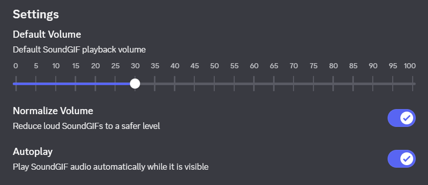

# SoundGIF for Vencord

Plays SoundGIF audio in Discord on every desktop platform supported by Vencord.



## Install

In the release archive, use the installer beside the `soundGif` folder:

- Windows: double-click `install-windows.cmd`.
- macOS: double-click `install-macos.command`.
- Linux: run `bash install-linux.sh`.

The same installer updates or repairs the custom Vencord build. For a manual install, copy this
folder to `Vencord/src/userplugins/soundGif`, then run:

```sh
pnpm build
```

Restart Discord and enable **SoundGIF** in Vencord's plugin settings.

## Behavior

- Detects SoundGIF data inside GIF attachments, regardless of filename.
- Starts at 30% volume by default.
- Reduces loud tracks toward -20 dBFS with a -6 dBFS peak target.
- Uses a real-time limiter for short peaks.
- Keeps the GIF and audio on one loop timeline.
- Stops playback when the GIF is off-screen, frozen, or Discord loses focus.
- Supports per-attachment mute plus default volume, normalization, and autoplay settings.
- Leaves Discord's native GIF hover controls usable.

## Untrusted files

The parser rejects malformed and oversized data before playback. It requires HTTPS without
redirects, caps downloaded and embedded-audio bytes, validates the GIF and SoundGIF structures,
checks CRC-32, restricts audio MIME types, and limits decoded duration.

Embedded bytes are passed only to Chromium's media decoder. They are never evaluated as
JavaScript, HTML, a module, or an executable.

## License

GPL-3.0-or-later.
